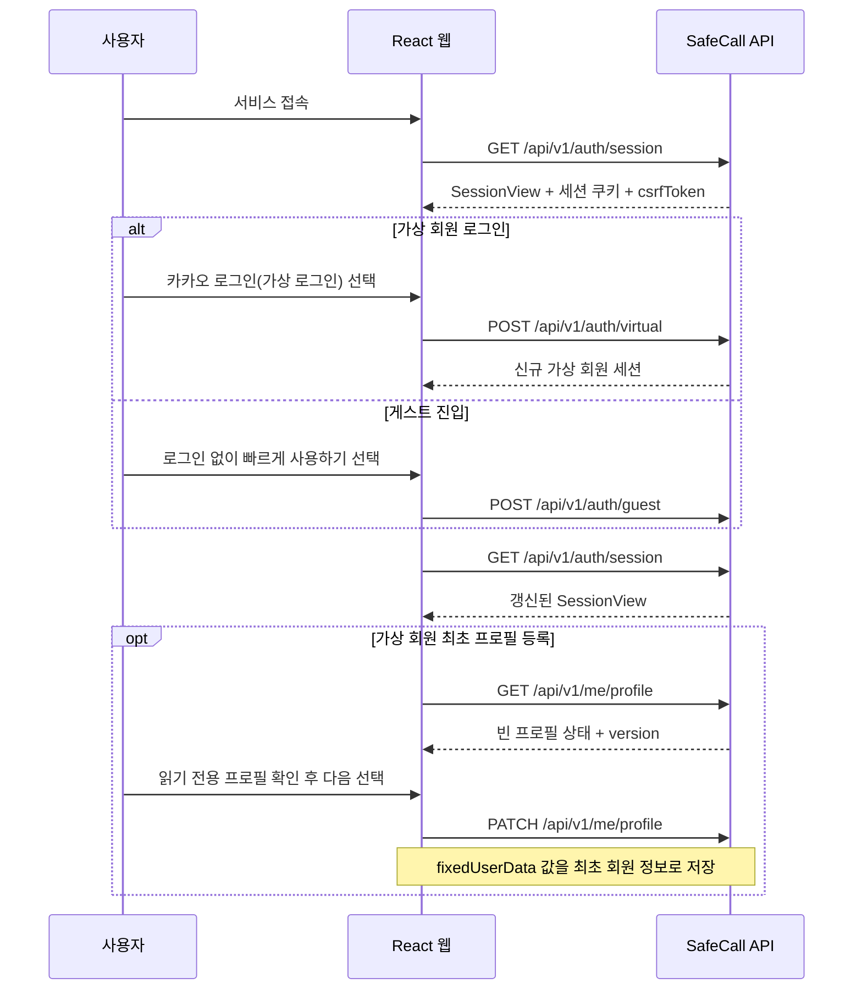
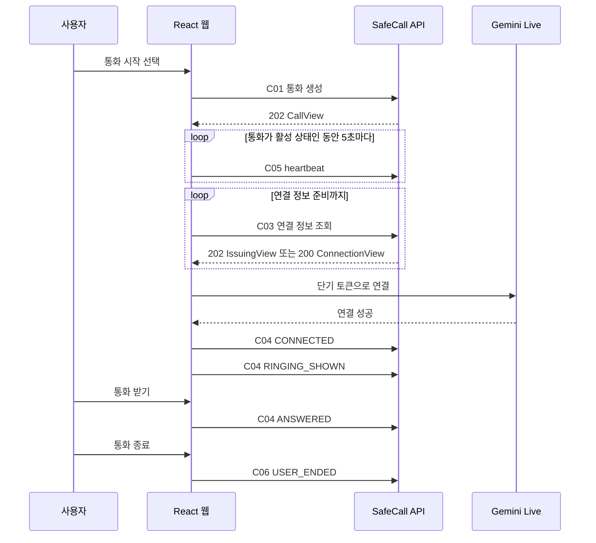

# SafeCall 화면별 API 연동 가이드

## 1. 문서 목적

이 문서는 현재 `user-web` 화면과 SafeCall 백엔드 API를 연결할 때, 어느 화면의 어떤 사용자 행동에서 어떤 API를 호출해야 하는지 정리한 구현 기준입니다.

- Swagger 주소: <https://api.dev-safecall.r-e.kr/swagger-ui/index.html>
- OpenAPI 원문: <https://api.dev-safecall.r-e.kr/v3/api-docs>
- 기준 명세: 첨부된 `SafeCall Web MVP API 명세서` (`4.2-web-mvp`, 서버 구현 기준 정본)
- 보조 확인 자료: Swagger/OpenAPI
- 확인일: 2026-09-18
- API 경로: 22개
- API 연산: 27개

이 문서는 서버 구현 기준 API 명세서와 현재 화면 코드를 대조한 연동 설계 및 구현 현황 문서입니다. 현재 연동 대상인 `A01`·`A02`·`A04`·`A05`, `U01`·`U02`·`U04`·`U05`·`U07`·`U08`·`U10`·`U11`·`U12`, `H01`·`H02`, `M01`, `C01`~`C06`, `R02`·`R03`은 프론트 코드에 반영되어 있습니다. `U09`, `O01`, `R01`은 현재 요구사항에 따라 호출하지 않습니다.

## 2. 현재 채팅 요구사항 우선 기준

다음 요구사항은 이전 Reference 화면보다 우선합니다.

1. 실제 카카오 API를 호출하지 않습니다.
2. `카카오 로그인(가상 로그인)` 버튼은 가상 회원 로그인 API만 호출합니다.
3. 사용자 정보는 고정값이며 사용자가 수정할 수 없습니다.
4. 긴급 연락처 추가 모달에는 `보호자 1`, `보호자 2`의 고정 정보가 표시됩니다.
5. 긴급 연락처 추가 모달의 이름·관계·전화번호는 수정할 수 없습니다.
6. 안심 메시지 API는 작성 자료 조회용이며 실제 SMS를 발송하지 않습니다.
7. 개인정보 처리 및 동의는 필수 조건이 아닙니다. 관련 화면 코드는 보존하지만 온보딩과 설정의 실제 사용자 흐름에서는 호출하지 않습니다.
8. 홈의 긴급 메시지 작성 화면은 `M01`의 작성 자료를 조회해 표시하되 실제 메시지 앱이나 SMS 전송 API는 호출하지 않습니다.
9. 운영 관측용 `O01` 이벤트는 수집하거나 전송하지 않습니다.
10. 가상 통화 수신 방식의 소리·진동·무음 선택 화면과 하단 개별 벨소리 진입 UI는 사용합니다. 벨소리 진입 UI는 클릭할 수 있지만 실제 종류 선택 화면은 호출하지 않습니다.
11. 진동 모드는 모바일 애플리케이션 전용 안내를 표시하고 현재 수신 방식을 유지하며 `U12` 요청을 보내지 않습니다.
12. 긴급 연락처 수정 UI는 만들지 않습니다. 삭제 UI는 서버가 발급한 UUID와 version으로 `U10`을 호출하고, 성공한 경우에만 화면 목록에서 제거합니다.
13. 계정 삭제 요청은 `R02`, 처리 상태 확인은 `R03`으로 연결하고 상태 화면에서 `PENDING`·`PROCESSING`·`COMPLETED`·`FAILED`를 반영합니다.
14. 이용 기록 화면은 구현하지 않으며 `R01`도 호출하지 않습니다.
15. 빠른 시작의 방향 배치는 프론트에서 관리하고, 선택 확정 시 상황 이름이나 배열 index가 아닌 `scenarioCode`를 `C01`에 전달합니다.
16. `C05` heartbeat는 통화 생성 직후 시작하고 이후 5초 간격으로 호출합니다.
17. 프로필 성별의 미확정 값은 `UNKNOWN` 문자열을 사용하지 않고 명세가 허용하는 명시적 `null`을 사용합니다.

따라서 명세에 프로필 수정 API가 있더라도 사용자에게 편집 UI를 제공하지 않습니다. 가상 로그인으로 신규 회원 세션을 만든 뒤 프론트의 `fixedUserData.ts` 값을 프로필 API로 전달하여 회원 정보를 최초 등록합니다.

## 3. 공통 API 연동 규칙

### 3.1 API 기본 주소

개발 환경의 API 기본 주소는 다음과 같이 공개 설정값으로 관리하는 것을 권장합니다.

```text
VITE_API_BASE_URL=https://api.dev-safecall.r-e.kr
```

API 키나 비밀값은 프론트엔드 환경변수에 저장하지 않습니다.

### 3.2 쿠키 기반 세션

명세의 기본 인증 방식은 `__Host-safecall-session` Secure·HttpOnly·SameSite=Lax 쿠키입니다. 탈퇴 접수 이후 삭제 상태 조회에는 서버가 발급한 `__Host-safecall-deletion` Secure·HttpOnly 접수증 쿠키도 사용될 수 있습니다. 두 쿠키 모두 JavaScript에서 직접 읽지 않습니다.

모든 API 요청은 다음 조건을 사용해야 합니다.

```ts
fetch(url, {
  credentials: "include",
});
```

프론트엔드와 API가 서로 다른 Origin에서 실행되므로 백엔드 CORS 설정에서 프론트엔드 Origin과 자격 증명 요청을 허용해야 합니다.

### 3.3 최초 세션 초기화 순서

명세에 따른 인증 순서는 다음과 같습니다.



`GET /api/v1/auth/session`은 로그인 화면이 나타난 뒤가 아니라 애플리케이션 초기화 단계에서 먼저 호출해야 합니다.

### 3.4 공통 헤더

| 헤더 | 적용 대상 | 처리 기준 |
| --- | --- | --- |
| `X-CSRF-Token` | 모든 `POST`, `PATCH`, `DELETE` | `A05`의 `SessionView.csrfToken` 사용. 세션 쿠키가 없는 `A04`만 예외 |
| `Idempotency-Key` | `U02`, `U05`, `U08`, `U09`, `U10`, `U12`, `C01`, `C04`, `C06`, `R02` | UUID 문자열. 새 논리 작업마다 생성하고 동일 요청 재시도에만 같은 키와 본문 재사용 |
| `X-Call-Page-Key` | `C01`~`C06` | 32바이트 난수의 패딩 없는 43자 Base64URL 문자열을 한 통화 페이지 생명주기 동안 유지 |
| `If-None-Match` | `GET /api/v1/call-options` | 이전 응답의 ETag가 있을 때만 전달 |
| `Origin` | 상태 변경 요청과 `A05` 세션 초기화 출처 검증 | 설정된 `WEB_ORIGIN`과 정확히 일치해야 하며 브라우저가 자동 설정하므로 코드에서 직접 설정하지 않음 |

본문이 있는 요청은 `Content-Type: application/json`을 사용하고 `Accept`는 JSON 응답을 허용해야 합니다. JSON에는 명세에 없는 필드, 중복 키 또는 뒤따르는 추가 값을 넣지 않으며 숫자·불리언·enum을 문자열로 대신 보내지 않습니다. 모든 날짜·시각은 시간대가 포함된 RFC 3339 문자열을 사용합니다. 모든 응답의 `X-Request-Id`는 장애 확인용으로 보존할 수 있지만 사용자 데이터와 함께 임의 로그로 남기지 않습니다.

### 3.5 서버 버전 충돌 방지

다음 요청은 조회 응답의 `version`을 `expectedVersion`으로 다시 보내야 합니다.

- `PATCH /api/v1/me/profile`
- `PATCH /api/v1/me/settings`
- `PATCH /api/v1/me/emergency-contacts/{contactId}`
- `DELETE /api/v1/me/emergency-contacts/{contactId}`
- `POST /api/v1/calls/{callId}/events`

화면에서 수정 요청을 보내기 전에 최신 데이터를 조회하고, 성공 응답으로 받은 새 `version`을 상태에 반영해야 합니다.

### 3.6 React에서 호출을 배치하는 기준

- 화면 진입으로 필요한 `GET` 요청은 전용 훅 또는 화면 진입 Effect에서 호출합니다.
- 화면 이동 전에 응답이 늦게 도착할 수 있으므로 `AbortController`와 이전 응답 무시 처리가 필요합니다.
- 로그인, 연락처 추가, 통화 시작, 통화 받기, 종료처럼 사용자 행동으로 발생하는 `POST`, `PATCH`, `DELETE`는 해당 버튼 이벤트 핸들러에서 호출합니다.
- 사용자 행동 요청을 상태 변경 후 Effect에서 간접 실행하면 개발 모드 재실행이나 상태 변화로 중복 호출될 수 있으므로 피합니다.

### 3.7 공통 오류와 재시도

오류 응답은 `{timestamp, status, code, message, errors, path}` 구조로 처리합니다. `errors`는 입력 검증 실패 필드 목록이며, 그 외에는 빈 배열입니다. 화면 분기는 HTTP 상태만 보지 않고 고정된 `code`를 함께 사용합니다.

| 상태·코드 | 프론트 처리 |
| --- | --- |
| `400`, `415`, `422` | 요청값을 고친 뒤 새 논리 작업과 새 멱등 키로 다시 요청 |
| `401` | `A05`로 세션을 초기화한 뒤 로그인 상태 재판단 |
| `403 CSRF_INVALID` | `A05`로 최신 CSRF 토큰을 받은 뒤 사용자 작업이 여전히 유효하면 재시도 |
| `404` | 다른 사용자·세션의 리소스 존재 여부를 추측하지 않고 현재 화면 정리 |
| `409 VERSION_CONFLICT` | 최신 리소스를 조회하고 사용자 작업 재적용 여부 판단 |
| `409 IDEMPOTENCY_CONFLICT` | 기존 키를 다른 작업에 재사용하지 않고 요청 흐름 점검 |
| `409 REQUEST_IN_PROGRESS`, `429 RATE_LIMITED` | `Retry-After` 이후 같은 키와 같은 본문으로 동일 논리 작업 재시도 |
| `410 CONNECTION_GRANT_EXPIRED` | 기존 연결 정보를 버리고 새 통화 시작 |
| `500`, `503` | 명세의 고정 메시지만 표시하고 내부 예외나 외부 공급자 원문은 노출하지 않음 |

## 4. 권장 프론트엔드 공통 구조

공통 HTTP 처리와 API별 계약은 다음 모듈로 분리했습니다. 화면 전환과 데모 전역 상태의 조합은 현재 규모에 맞춰 `App.tsx`에서 담당합니다.

| 권장 모듈 | 책임 |
| --- | --- |
| `src/api/httpClient.ts` | 기본 주소, `credentials`, JSON 처리, 공통 오류 변환 |
| `src/api/sessionApi.ts` | `A01`, `A02`, `A04`, `A05` |
| `src/api/profileApi.ts` | `U01`, `U02` |
| `src/api/contactApi.ts` | `U07`~`U10` |
| `src/api/permissionApi.ts` | `U04`, `U05` |
| `src/api/homeApi.ts` | `H01`, `H02` |
| `src/api/callApi.ts` | `C01`~`C06` |
| `src/api/settingsApi.ts` | `U11`, `U12` |
| `src/api/messageApi.ts` | `M01` |
| `src/api/deletionApi.ts` | `R02`, `R03` |
| `App.tsx` | 세션 종류, CSRF 토큰, 선택 코드, 활성 통화, 페이지 키, 통화 버전과 상태 조합 |

통화 연결 토큰은 응답을 받은 현재 페이지 메모리에서만 사용하고 로컬 스토리지, 세션 스토리지, 로그에 저장하지 않습니다.

## 5. 화면별 API 연동 계획

### 5.1 애플리케이션 시작 — `App.tsx`

#### 호출 API

`GET /api/v1/auth/session` (`A05`)

#### 호출 시점

React 애플리케이션 최초 시작 시 1회 호출합니다. 로그인 또는 로그아웃 직후에도 다시 호출해 세션 상태를 확정합니다.

#### 응답 사용

| 응답 필드 | 사용 위치 |
| --- | --- |
| `kind` | 게스트·가상 회원 화면 분기 |
| `isAuthenticated` | 로그인 화면 또는 홈 화면 진입 결정 |
| `csrfToken` | 이후 상태 변경 요청의 `X-CSRF-Token` |
| `expiresAt` | 세션 만료 안내 및 재초기화 |
| `settingsMode` | `LOGIN_ONLY` 또는 `MEMBER`에 따른 설정 기능 범위 분기 |

#### 구현 주의사항

- 세션 초기화가 끝나기 전에는 로그인이나 홈을 확정적으로 렌더링하지 않고 초기 로딩 상태를 둡니다.
- `kind`는 `ANONYMOUS`, `GUEST`, `MEMBER`이며 `isAuthenticated`는 `MEMBER`에서만 `true`입니다.
- `settingsMode`는 사용자 ID가 없으면 `LOGIN_ONLY`, 있으면 `MEMBER`입니다. 온보딩 완료 상태를 뜻하는 값이 아니므로 프로필·연락처·권한 완료 여부는 각 API 응답으로 판단합니다.

### 5.2 로그인 화면 — `Login.tsx`

#### 카카오 로그인(가상 로그인) 버튼

`POST /api/v1/auth/virtual` (`A02`)

- 요청 본문: `{}`
- 필수 헤더: `X-CSRF-Token`
- 성공 응답: `SessionView`
- 성공 후: `A05` 재조회 → `profile` 화면 이동
- 실패 시: 로그인 화면 유지 및 네트워크·세션 오류 표시

이 버튼에서는 실제 카카오 OAuth 페이지로 이동하거나 카카오 API를 호출하지 않습니다.

#### 로그인 없이 빠르게 사용하기 버튼

`POST /api/v1/auth/guest` (`A01`)

- 요청 본문: `{}`
- 필수 헤더: `X-CSRF-Token`
- 성공 응답: `SessionView`
- 성공 후: `A05` 재조회 → 현재 요구사항에 맞는 게스트 온보딩 또는 홈 이동

버튼 이벤트에서 `A01` 성공을 확인한 뒤 `A05`를 재조회하고, 갱신된 세션 종류에 따라 다음 화면으로 이동합니다. 요청 중에는 중복 클릭을 막습니다.

### 5.3 사용자 정보 화면 — `Profile.tsx`

#### 화면 진입

`GET /api/v1/me/profile` (`U01`)

가상 로그인 직후 신규 회원의 프로필 상태와 `version`을 조회합니다. 서버에는 사전 등록된 고정 사용자 프로필이 없으므로, 최초 조회에서는 빈 필드 또는 `missingFields`가 포함될 수 있습니다.

이 호출의 목적은 서버 고정값을 가져오는 것이 아니라 `U02`에 필요한 현재 `version`과 프로필 등록 여부를 확인하는 것입니다.

#### 온보딩의 다음 버튼

읽기 전용으로 표시된 프론트 고정 정보를 확인하고 `다음` 버튼을 누르면 `PATCH /api/v1/me/profile` (`U02`)을 호출합니다. 이 요청이 프론트의 고정값을 서버의 신규 회원 정보로 최초 등록하는 단계입니다.

```json
{
  "name": "fixedUserData의 name",
  "gender": "MALE",
  "birthDate": "YYYY-MM-DD",
  "phone": "숫자 전화번호",
  "isConfirmed": true,
  "expectedVersion": 1
}
```

#### 현재 요구사항에 따른 제한

- 모든 필드는 계속 읽기 전용으로 유지합니다.
- `U02` 요청값은 사용자가 입력한 값이 아니라 프론트의 `fixedUserData.ts`에서 가져옵니다.
- 프론트 성별 타입은 `"MALE" | "FEMALE" | null`로 정의합니다. 성별이 확정되지 않은 경우 `UNKNOWN` 문자열을 만들지 않고 `gender` 속성을 생략하지도 않으며 명시적인 JSON `null`을 전송합니다.
- 최초 등록이 성공하면 `U02` 응답의 `ProfileView`와 새 `version`을 세션 상태에 반영합니다.
- 설정의 사용자 정보 확인 화면에서는 저장된 결과를 확인하기 위해 `U01`만 호출하고 `U02`는 다시 호출하지 않습니다.
- 이후 서버 응답과 `fixedUserData.ts`가 다르더라도 화면 진입마다 자동으로 덮어쓰지 않습니다. 고정값 변경이 필요하면 데모 초기 데이터와 신규 회원 생성 절차를 함께 갱신합니다.

### 5.4 긴급 연락처 화면 — `Contacts.tsx`

#### 화면 진입

`GET /api/v1/me/emergency-contacts` (`U07`)

응답의 `items`를 연락처 카드에 표시합니다. `EmergencyContact.id`는 서버 UUID 문자열을 사용하며, API의 `relationship`은 화면 모델의 `relation`으로 변환합니다. `slot`과 `version`도 함께 보관합니다.

#### 고정 보호자 추가 모달의 추가 버튼

`POST /api/v1/me/emergency-contacts` (`U08`)

```json
{
  "name": "보호자 1",
  "relationship": "아버지",
  "phone": "010-0000-0000"
}
```

- 첫 번째 추가는 `보호자 1`, 두 번째 추가는 `보호자 2` 고정값을 사용합니다.
- 모달 입력값은 계속 읽기 전용입니다.
- 필수 헤더: `X-CSRF-Token`, `Idempotency-Key`
- 성공 응답의 `ContactView`를 목록에 추가합니다.
- 실패 시 로컬 목록을 먼저 추가하지 않습니다.
- 온보딩의 다음 버튼은 동의 화면을 거치지 않고 `permissionBasic` 권한 안내 화면으로 이동합니다.

#### 연락처 수정·삭제

| 사용자 기능 | API | 비고 |
| --- | --- | --- |
| 추가된 연락처 수정 | `PATCH /api/v1/me/emergency-contacts/{contactId}` (`U09`) | 현재 구현 대상 아님 |
| 추가된 연락처 삭제 | `DELETE /api/v1/me/emergency-contacts/{contactId}` (`U10`) | 본문에 `expectedVersion` 필요 |

`editContacts` 화면에는 각 연락처의 삭제 버튼과 확인 모달이 구현되어 있습니다. 수정 기능은 제공하지 않습니다. 삭제를 확인하면 서버 UUID와 `expectedVersion`으로 `U10`을 호출하며, 성공 응답을 받은 뒤에만 로컬 목록에서 제거합니다. 실패하면 기존 목록을 유지합니다. 고정 추가 모달 입력은 계속 읽기 전용으로 유지합니다.

### 5.5 개인정보 처리 및 AI 통화 동의 — `Terms.tsx`

개인정보를 수집하지 않는 데모 요구사항에 따라 이 화면은 실제 사용자 흐름에서 제외합니다.

- `Terms.tsx`, 관련 스타일, `Screen` 타입과 `App.tsx`의 렌더링 분기는 삭제하지 않습니다.
- 긴급 연락처 화면의 다음 버튼은 `permissionBasic`으로 바로 이동합니다.
- 설정 화면에서는 `개인정보 정책` 메뉴를 표시하지 않습니다.
- 내부 화면 순서에서도 `terms`를 제외하여 테스트 이동으로 진입하지 않게 합니다.
- 이 화면에서는 API를 호출하지 않습니다.

현재 요구사항에서는 동의가 필수가 아니므로 별도의 동의 저장이나 검사 절차를 구현하지 않습니다. 서버 구현 기준 명세의 `CreateCall` 요청과 `C01` 선행 조건에도 동의 필드가 없습니다. `C01`에 동의 값을 추가로 전송하지 않으며, `U02.isConfirmed`는 프로필 정보 확인값으로 반드시 `true`여야 하지만 개인정보 처리 동의 값으로 해석하지 않습니다.

### 5.6 권한 안내 화면 — `PermissionIntro.tsx`

#### 화면 진입

`GET /api/v1/me/permissions` (`U04`)

서버에 마지막으로 저장된 마이크·위치 권한 상태를 가져옵니다. 단, 서버 값은 실제 브라우저의 현재 권한을 보장하지 않으므로 화면에서 브라우저 권한 API를 다시 확인해야 합니다.

#### 다음 버튼으로 권한 요청 완료 후

`POST /api/v1/me/permissions` (`U05`)

```json
{
  "permissions": [
    { "code": "MICROPHONE", "status": "GRANTED" },
    { "code": "LOCATION", "status": "DENIED" }
  ]
}
```

브라우저 결과와 API 값의 매핑은 다음과 같습니다.

| 브라우저 결과 | API 상태 |
| --- | --- |
| 허용됨 | `GRANTED` |
| 사용자가 거부함 | `DENIED` |
| 지원하지 않음·아직 묻지 않음·확정 불가 | `NOT_DETERMINED` |

- 필수 헤더: `X-CSRF-Token`, `Idempotency-Key`
- 마이크가 거부되면 현재 화면에 머뭅니다.
- 위치만 거부되면 `DENIED`를 저장하고 위치 없이 다음 단계로 진행합니다.
- 위치 좌표는 이 API로 보내지 않습니다.

### 5.7 설정의 권한 화면 — `PermissionSetting.tsx`

`U04`로 저장 상태를 표시하고, `권한 설정하기` 버튼에서 브라우저 권한을 요청한 뒤 `U05`로 결과를 저장합니다.

설정 화면에서도 브라우저 권한을 다시 요청한 뒤 `U05`로 결과를 저장합니다. 저장된 서버 상태는 `U04` 응답으로 표시하며 위치 좌표는 전송하지 않습니다.

### 5.8 온보딩 완료 화면 — `Complete.tsx`

현재 코드와 데모 흐름에서는 설정 완료 안내와 홈 이동 버튼만 제공합니다. 사용자가 확인 버튼을 누르면 `home` 화면으로 이동하며, 이 화면에서 직접 호출할 API는 없습니다.

### 5.9 홈 화면 — `Home.tsx`

#### 화면 진입 및 복귀

`GET /api/v1/home` (`H01`)

| 응답 필드 | 화면 사용 위치 |
| --- | --- |
| `isMessageComposeEligible` | 긴급 메시지 사용 가능 여부 |
| `messageBlockReasons` | 사용 불가 이유 안내 및 이동 대상 결정 |
| `isLocationPermissionGranted` | 위치 공유 상태 문구 |
| `guardianCount` | 등록 보호자 수 표시 또는 연락처 등록 유도 |
| `settingsMode` | `LOGIN_ONLY`·`MEMBER`에 따른 설정 기능 범위 |

위치 공유 상태는 `HomeView.isLocationPermissionGranted`로 표시합니다. 긴급 메시지 작성 버튼은 `isMessageComposeEligible`과 `messageBlockReasons`에 따라 작성 화면 진입 또는 필요한 화면 안내를 결정합니다.

#### 통화 선택지 미리 불러오기

`GET /api/v1/call-options` (`H02`)

- 상황 목록: `scenarios`
- 통화 상대 목록: `counterparts`
- 길게 누르기 시간: `quickStart.holdMs`
- 빠른 시작 기본 상대: `quickStart.counterpartCode`
- 캐시 버전: `catalogVersion`과 응답 ETag

홈 진입 시 `H01`과 `H02`를 병렬 조회할 수 있습니다. `H02`는 ETag와 마지막 성공 응답을 함께 저장하고 이후 `If-None-Match`를 사용합니다. `304`와 빈 본문을 받으면 저장한 선택지를 그대로 재사용합니다. `H02`만 `Cache-Control: no-cache, private`이며 다른 API 응답은 `no-store`입니다.

#### 안심 메시지 작성 기능

일반 안심 메시지 작성 화면에 다음 API를 연결합니다.

`GET /api/v1/message-composer?mode=SAFETY` (`M01`)

홈의 `H01.isMessageComposeEligible`이 `true`일 때 `SAFETY` 모드를 조회합니다. 사용할 수 없다면 `messageBlockReasons`의 `LOGIN_REQUIRED`, `PROFILE_REQUIRED`, `CALL_ALREADY_OPEN`, `DATA_CLEANUP_PENDING`, `CONTACT_REQUIRED`를 기준으로 안내하거나 필요한 화면으로 이동합니다.

`M01`에는 요청 본문을 보내지 않으며 `mode` 외 쿼리, 빈 `mode`, 중복 `mode`를 추가하지 않습니다. 응답의 `mapTemplate`은 서버에서 제공될 때만 사용하며 이 API에 브라우저 위치 좌표를 보내지 않습니다.

`EmergencyMessage.tsx` 진입 시 `credentials: include`, `cache: no-store`로 `M01`을 호출합니다. 로딩 중에는 준비 화면을 표시하고, 성공하면 `recipients`, `identity`, `baseBody`, `notice`, `isLocationPermissionGranted`를 수신자·초안·안내 UI에 반영합니다. 화면을 벗어나면 `AbortController`로 진행 중인 요청을 취소합니다.

전송 버튼은 실제 메시지 앱이나 SMS API를 호출하지 않고 데모 안내만 표시합니다. 위치 좌표도 서버에 전송하지 않습니다.

`M01`에서 서버 구현 기준 명세에 정의된 오류는 다음과 같이 처리합니다.

| HTTP 상태 | 오류 코드 | 화면 처리 |
| --- | --- | --- |
| `400` | `INVALID_REQUEST` | 오류 안내와 다시 시도 |
| `401` | `SESSION_EXPIRED` | 로그인 화면 이동 |
| `403` | `LOGIN_REQUIRED` | 가상 로그인 화면 이동 |
| `409` | `PROFILE_REQUIRED` | 사용자 정보 화면 이동 |
| `409` | `CONTACT_REQUIRED` | 긴급 연락처 화면 이동 |
| `409` | `CALL_ALREADY_OPEN` | 홈 화면 이동 |
| `409` | `DATA_CLEANUP_PENDING` | 삭제 처리 상태 화면 이동 |

### 5.10 상황 선택 화면 — `PersonaUse`

`H02`의 `scenarios`로 선택지를 구성합니다.

| API 필드 | 사용 위치 |
| --- | --- |
| `code` | 통화 생성 시 `scenarioCode` |
| `label` | 화면 선택지 문구 |
| `quickDirection` | 현재 프론트에서는 사용하지 않음 |

빠른 시작의 위·오른쪽·아래·왼쪽 배치는 프론트에서 다음처럼 상황 코드에 고정 매핑합니다.

| `scenarioCode` | 프론트 배치 |
| --- | --- |
| `FOLLOWED` | 위 |
| `UNSAFE_TAXI` | 오른쪽 |
| `STRANGER_NEARBY` | 아래 |
| `WALKING_ALONE` | 왼쪽 |

선택 결과는 배열 index가 아니라 `scenarioCode`로 저장하고 전달합니다. 사용자가 포인터를 놓아 선택이 확정되는 시점에 선택 완료 애니메이션과 별개로 `C01.scenarioCode`에 해당 코드를 전달합니다. 화면 문구인 `label`은 변경·현지화될 수 있으므로 식별값으로 사용하지 않습니다.

### 5.11 통화 상대 선택 화면 — `PersonaPeople`

`H02`의 `counterparts`로 선택지를 구성합니다.

| API 필드 | 사용 위치 |
| --- | --- |
| `code` | 통화 생성 시 `counterpartCode` |
| `label` | 선택 화면의 아빠·엄마·친구 문구 |
| `displayName` | 수신 화면과 통화 화면 표시 이름 |

현재 인물 사진은 로컬 asset을 유지하되, 상대 코드와 표시 이름은 API 응답을 기준으로 사용합니다.

빠른 시작에서는 `H02.quickStart.counterpartCode`를 사용합니다. 현재 서버 계약상 `startMode: QUICK`의 상대는 `FATHER`여야 하므로 다른 값이면 `C01`을 호출하지 않고 선택지 응답을 다시 조회합니다.

### 5.12 통화 준비 확인 화면 — `CallSetupCheck.tsx`

표준 통화의 `다음` 버튼에서 통화 생성 요청을 시작합니다.

`POST /api/v1/calls` (`C01`)

```json
{
  "clientCallId": "프론트에서 생성한 UUID",
  "startMode": "STANDARD",
  "scenarioCode": "H02에서 선택한 코드",
  "counterpartCode": "H02에서 선택한 코드",
  "microphonePermission": "GRANTED"
}
```

- 필수 헤더: `X-CSRF-Token`, `Idempotency-Key`, `X-Call-Page-Key`
- 성공 코드: `202`
- 성공 후 `CallView`를 저장하고 `voiceLoading`으로 이동합니다.
- 실패 시 현재 화면에 머물면서 재시도 또는 대체 통화를 안내합니다.

빠른 시작은 홈 화면에서 사용자 선택을 놓는 순간 같은 API를 호출하되 `startMode`를 `QUICK`으로 보냅니다. `VoiceLoading` 화면 Effect에서 `C01`을 호출하면 개발 모드에서 중복 실행될 수 있으므로, 빠른 시작 이벤트 핸들러에서 요청하고 성공 후 이동하는 방식을 권장합니다.

### 5.13 통화 연결 로딩 화면 — `VoiceLoading.tsx`

통화 생성 성공 직후 다음 두 동작을 시작합니다.

1. `POST /api/v1/calls/{callId}/heartbeat` (`C05`)를 즉시 호출하고 이후 5초마다 반복
2. `GET /api/v1/calls/{callId}/connection` (`C03`)으로 연결 정보 조회

`C03` 응답 처리:

| 상태 | 처리 |
| --- | --- |
| `202 IssuingView` | `retryAfterMs` 이후 다시 조회 |
| `200 ConnectionView` | 토큰으로 Gemini Live 연결 시작 |

`C03`의 `grantId` 쿼리는 선택 사항입니다. 서버가 발급한 연결 세대를 다시 조회할 때만 UUID를 전달하며, 새 연결 정보 조회에는 임의의 값을 만들지 않습니다.

Gemini Live 연결 성공 후 다음 사건을 기록합니다.

`POST /api/v1/calls/{callId}/events` (`C04`)

```json
{
  "eventId": "UUID",
  "type": "CONNECTED",
  "grantId": "C03 응답 grantId",
  "occurredAt": "현재 ISO 날짜",
  "expectedVersion": 2
}
```

`expectedVersion`에는 문자열이 아니라 가장 최근 `CallView.version` 숫자를 넣습니다. 사건 성공 응답으로 받은 새 `version`을 다음 사건에 사용합니다.

3초 고정 타이머는 사용하지 않습니다. `C03`이 `READY`를 반환하고 Gemini Live 연결 및 `C04 CONNECTED` 기록이 성공한 뒤 수신 화면으로 이동합니다.

### 5.14 가상 수신 전화 화면 — `CallRinging.tsx`

#### 화면 표시 직후

`C04`에 `RINGING_SHOWN` 사건을 기록합니다.

명세가 요구하는 사건 순서는 다음과 같습니다.

```text
CONNECTED → RINGING_SHOWN → ANSWERED
```

#### 통화 받기

`C04`에 `ANSWERED` 사건을 기록하고 성공 후 `call` 화면으로 이동합니다.

#### 통화 거절

`POST /api/v1/calls/{callId}/end` (`C06`)

```json
{
  "reason": "DECLINED",
  "occurredAt": "현재 ISO 날짜"
}
```

성공 여부와 관계없이 로컬 소켓·마이크·오디오를 정리하고 홈으로 이동합니다.

#### 표시 정보

현재 고정된 `아빠` 대신 `CallView.displayName`을 표시합니다. 사진은 `counterpartCode`와 로컬 asset 매핑을 사용할 수 있습니다.

### 5.15 통화 중 화면 — `Call.tsx`

#### 통화 유지

- `C05`는 통화 생성 성공 직후 한 번 호출하고 이후 5초 간격으로 반복 전송합니다. 각 요청은 이전 요청이 끝난 뒤 예약하여 느린 네트워크에서 요청이 겹치지 않게 합니다.
- C05 응답의 `state`, `leaseExpiresAt`, `expiresAt`을 갱신합니다. heartbeat는 통화 `version`이나 전체 통화 상한을 늘리지 않습니다.
- 응답의 `leaseExpiresAt`이 다음 예정 시점보다 이르거나 세션·통화 종료 오류가 발생하면 일반 반복을 계속하지 않고 `C02`로 서버 상태를 확인합니다.
- 탭 복귀나 연결 상태 확인이 필요할 때 `GET /api/v1/calls/{callId}` (`C02`)로 서버 상태를 재확인합니다.

#### 정상 종료

종료 버튼에서 로컬 마이크·재생·WebSocket을 먼저 중지하고 `C06`을 다음 값으로 호출합니다.

```json
{
  "reason": "USER_ENDED",
  "occurredAt": "현재 ISO 날짜"
}
```

#### 페이지 상태에 따른 종료 사유

| 상황 | `EndCall.reason` |
| --- | --- |
| 뒤로 이동 | `BACK_NAVIGATION` |
| 탭 비활성화 | `TAB_HIDDEN` |
| 페이지 종료 | `PAGE_EXIT` |
| 새로고침 | `PAGE_RELOAD` |
| 대체 통화 전환 | `SWITCH_TO_FALLBACK` |

페이지 종료 시 일반 `fetch` 완료는 보장되지 않으므로 `keepalive` 가능한 종료 요청을 사용하고, 서버의 lease 만료 정리도 전제로 해야 합니다.

#### 연결 실패 기록

연결 또는 오디오 실패 시 `C04`에 `FAILED` 사건과 다음 `errorCode` 중 하나를 보냅니다.

- `CONNECTION_FAILED`
- `RINGING_FAILED`
- `MICROPHONE_FAILED`
- `AUDIO_FAILED`
- `CONNECTION_LOST`

#### 대체 통화

현재 대체 통화 버튼은 로컬 녹음 파일을 재생합니다. 대체 통화로 전환할 때는 AI 통화가 계속 열린 상태로 남지 않도록 먼저 `C06`을 `SWITCH_TO_FALLBACK`으로 호출한 뒤 로컬 음성을 재생해야 합니다.

### 5.16 전체 통화 API 순서



### 5.17 설정 화면 — `Setting.tsx`

#### 화면 진입

다음 API를 병렬 호출할 수 있습니다.

- `GET /api/v1/me/profile` (`U01`): 사용자 이름 표시
- `GET /api/v1/me/settings` (`U11`): 수신 방식 표시
- `GET /api/v1/me/emergency-contacts` (`U07`): 연락처 수 표시

#### 로그아웃 확인 버튼

`POST /api/v1/auth/logout` (`A04`)

- 요청 본문: `{}`
- 성공 코드: `204`
- 성공 후 프론트 상태, 통화 상태, 캐시를 초기화합니다.
- 이후 `A05`를 다시 호출하고 로그인 화면으로 이동합니다.
- 실패하면 로그인 상태를 유지하고 오류를 표시합니다.

`A04` 성공 후 `A05`를 재조회하고 로컬 세션·통화·캐시를 초기화한 다음 로그인 화면으로 이동합니다. 실패하면 기존 로그인 상태를 유지합니다.

### 5.18 가상 통화 수신 벨소리 설정 — `SoundSetting.tsx`

설정 메뉴에서 이 화면으로 진입하여 소리·진동·무음 수신 방식을 선택합니다.

#### 화면 진입

`GET /api/v1/me/settings` (`U11`)

#### 수신 방식 변경

`PATCH /api/v1/me/settings` (`U12`)

```json
{
  "incomingAlertMode": "RINGTONE",
  "expectedVersion": 1
}
```

| 현재 UI | API 값 | 연동 가능 여부 |
| --- | --- | --- |
| 소리 | `RINGTONE` | 가능 |
| 무음 | `SILENT` | 가능 |
| 진동 | 대응 enum 없음 | 모바일 앱 전용 오류 표시, 상태 유지, API 요청 안 함 |

하단 개별 벨소리 종류 선택 행은 기존 UI와 클릭 피드백을 유지합니다. 다만 클릭해도 선택 모달은 열리지 않으며, 선택 모달 관련 컴포넌트 코드·스타일·오디오 파일은 삭제하지 않고 `RINGTONE_SELECTION_SCREEN_ENABLED = false`로 비활성화합니다. 따라서 개별 벨소리 이름을 서버에 저장하는 연동은 구현하지 않습니다.

진동 버튼을 누르면 `mobileOnlyVibration` 오류 모달을 표시하고 `setMode`를 호출하지 않습니다. 따라서 기존 소리 또는 무음 상태가 유지되며, 추후 `U12`가 연결되어도 진동 값으로 요청하지 않습니다.

### 5.19 탈퇴 화면 — `Withdraw.tsx`

#### 탈퇴하기 버튼

`POST /api/v1/me/data-deletions` (`R02`)

```json
{
  "scope": "ACCOUNT",
  "isConfirmed": true
}
```

- 필수 헤더: `X-CSRF-Token`, `Idempotency-Key`
- 성공 코드: `202`
- 응답의 `DeletionView.id`를 삭제 작업 ID로 보관합니다.
- 삭제 접수증은 HttpOnly 쿠키로 발급되므로 JavaScript에서 읽으려 하지 않습니다.

탈퇴하기 버튼은 `R02`를 호출하고 성공 응답의 작업 ID를 보관한 뒤 `DeletionStatus.tsx`로 이동합니다. 요청 실패 시 현재 화면을 유지합니다.

#### 삭제 상태 확인

`GET /api/v1/data-deletions/{jobId}` (`R03`)

삭제 처리 상태 화면은 `R03`을 주기적으로 조회해 `PENDING`, `PROCESSING`, `COMPLETED`, `FAILED` 응답에 맞춰 갱신합니다. 계정 삭제 후에는 일반 세션 대신 삭제 접수증 쿠키로 조회될 수 있습니다. 잘못된 작업 ID, 다른 사용자 작업, 잘못되거나 만료된 접수증은 모두 `404 RESOURCE_NOT_FOUND`로 동일하게 처리하며 작업 존재 여부를 추측하지 않습니다.

이용 기록 화면과 삭제 기능은 구현하지 않으므로 `scope: USAGE_HISTORY`는 사용하지 않습니다.

### 5.20 도움말과 정적 안내 화면

다음 기능은 현재 직접 연결할 API가 없습니다.

- `HelpScreen.tsx`
- SOS 안내 드로어
- 통화 준비 안내 문구

이 화면들의 열림·실패 여부를 별도로 수집하거나 전송하지 않습니다.

## 6. 화면에 직접 속하지 않는 API

### 6.1 이용 기록 조회 — 사용하지 않음

`GET /api/v1/me/usage-history` (`R01`)

- `limit`: 1~100, 기본 20
- `cursor`: 다음 페이지 조회용

현재 요구사항에서는 이용 기록 화면을 구현하지 않습니다. `R01`은 프론트 연동 대상에서 제외하며 호출하지 않습니다.

## 7. 연동 검토 엔드포인트와 화면 대응표

| ID | 메서드와 경로 | 연결 화면·기능 | 우선순위 |
| --- | --- | --- | --- |
| A05 | `GET /api/v1/auth/session` | 앱 시작, 로그인·로그아웃 후 세션 재확인 | 구현 완료 |
| A01 | `POST /api/v1/auth/guest` | 로그인 없이 빠르게 사용하기 | 구현 완료 |
| A02 | `POST /api/v1/auth/virtual` | 카카오 로그인(가상 로그인) | 구현 완료 |
| A04 | `POST /api/v1/auth/logout` | 설정의 로그아웃 확인 | 구현 완료 |
| U01 | `GET /api/v1/me/profile` | 프로필·설정 사용자 정보 | 구현 완료 |
| U02 | `PATCH /api/v1/me/profile` | 프론트 고정 프로필로 신규 회원 정보 최초 등록 | 구현 완료 |
| U04 | `GET /api/v1/me/permissions` | 권한 안내·설정 | 구현 완료 |
| U05 | `POST /api/v1/me/permissions` | 브라우저 권한 결과 저장 | 구현 완료 |
| U07 | `GET /api/v1/me/emergency-contacts` | 연락처 목록·설정 | 구현 완료 |
| U08 | `POST /api/v1/me/emergency-contacts` | 고정 보호자 추가 모달 | 구현 완료 |
| U09 | `PATCH /api/v1/me/emergency-contacts/{contactId}` | 연락처 수정 | 연동 대상 아님 |
| U10 | `DELETE /api/v1/me/emergency-contacts/{contactId}` | 서버 UUID·version 기반 삭제 | 구현 완료 |
| U11 | `GET /api/v1/me/settings` | 소리·진동·무음 설정 화면 | 구현 완료 |
| U12 | `PATCH /api/v1/me/settings` | 수신 방식 변경 | 구현 완료 |
| H01 | `GET /api/v1/home` | 홈 기능 가능 상태 | 구현 완료 |
| H02 | `GET /api/v1/call-options` | 상황·상대·빠른 시작 선택지 | 구현 완료 |
| M01 | `GET /api/v1/message-composer` | 일반 안심 메시지 작성 자료와 오류 처리 | 구현 완료 |
| C01 | `POST /api/v1/calls` | 표준·빠른 통화 시작 | 구현 완료 |
| C02 | `GET /api/v1/calls/{callId}` | 통화 상태 재확인 | 구현 완료 |
| C03 | `GET /api/v1/calls/{callId}/connection` | 연결 로딩과 Gemini Live 연결 | 구현 완료 |
| C04 | `POST /api/v1/calls/{callId}/events` | 연결·수신 표시·받기·실패 사건 | 구현 완료 |
| C05 | `POST /api/v1/calls/{callId}/heartbeat` | 통화 생존 신호 | 구현 완료 |
| C06 | `POST /api/v1/calls/{callId}/end` | 거절·종료·페이지 이탈·대체 통화 | 구현 완료 |
| O01 | `POST /api/v1/telemetry/events` | 운영 관측 사건 | 현재 요구사항에 따라 연동 대상 아님 |
| R01 | `GET /api/v1/me/usage-history` | 이용 기록 화면 | 연동 대상 아님 |
| R02 | `POST /api/v1/me/data-deletions` | 계정 탈퇴 삭제 요청(`scope: ACCOUNT`) | 구현 완료 |
| R03 | `GET /api/v1/data-deletions/{jobId}` | 삭제 처리 상태 조회 | 구현 완료 |

서버 구현 기준 명세에는 22개 경로와, 같은 경로의 여러 메서드를 구분한 27개 연산이 있습니다.

## 8. API 계약 반영 결과

### 8.1 해결된 데이터 타입과 흐름

| 기존 코드 | API 계약 | 반영 결과 |
| --- | --- | --- |
| `EmergencyContact.id: number` | `ContactView.id: uuid string` | 문자열 ID, slot, version 반영 완료 |
| `EmergencyContact.relation` | `relationship` | API·화면 변환 계층 반영 완료 |
| 상황·상대 선택을 배열 index로 보관 | `scenarioCode`, `counterpartCode` | 코드 기반 상태로 변경 완료 |
| `UserGender`에 `UNKNOWN` 문자열 포함 | `MALE`, `FEMALE` 또는 명시적 `null` | `UNKNOWN` 제거와 `null` 타입 반영 완료 |
| 홈 가능 상태가 `false`로 고정 | `HomeView` | API 응답 기반 처리 완료 |
| 통화 상대가 `아빠`로 고정 | `CallView.displayName` | 응답 기반 표시 완료 |
| 로딩 화면이 3초 뒤 자동 이동 | `C03` 연결 준비 상태 | 실제 연결 완료 기반 이동으로 변경 완료 |
| 연락처 추가 후 로컬 번호 ID 생성 | 서버 UUID와 version | `U08` 응답 기반 목록 갱신 완료 |

### 8.2 확정된 프론트 구현 결정

1. `H02.scenarios[].quickDirection`은 사용하지 않습니다. 프론트의 고정 방향 매핑으로 선택 UI를 구성하고, 사용자가 선택을 확정하면 `scenarioCode`를 `C01`에 전달합니다.
2. `C05` heartbeat는 통화 생성 직후 시작하고 이후 5초 간격으로 호출합니다. 요청 중첩을 막고 매 응답의 `leaseExpiresAt`을 함께 감시합니다.
3. 프론트의 `UserGender`에서 `UNKNOWN`을 제거하고 `"MALE" | "FEMALE" | null`을 사용합니다. 미확정 상태는 `U02`에서 `gender` 필드를 생략하지 않고 JSON `null`로 전달합니다.

### 8.3 Reference와 현재 요구사항의 차이

- `Login.png`의 실제 카카오 로그인 표현은 현재 가상 로그인 요구사항으로 대체합니다.
- `Setting-1.png`의 사용자 정보 수정 화면은 현재 읽기 전용 사용자 정보 확인 화면으로 처리합니다.
- `Login - Onboarding-4.png`의 개인정보 처리 및 동의 화면은 코드만 보존하고 온보딩 흐름에서는 제외합니다.
- `Setting.png`의 개인정보 정책 메뉴는 현재 설정 화면에서 표시하지 않습니다.
- `Setting.png`의 가상 통화 수신 벨소리 설정 메뉴와 `Setting-4.png`의 소리·진동·무음 및 하단 벨소리 진입 UI는 사용합니다. 하단 진입 UI를 눌러도 별도 종류 선택 모달은 표시하지 않습니다.
- `Setting-4.png`의 진동 선택은 웹에서 적용하지 않고 모바일 앱 전용 안내 모달로 대체합니다.
- `Setting-3.png`의 연락처 카드에는 현재 요구사항에 따라 삭제 버튼과 확인 모달을 추가합니다.
- `Setting-5.png`의 탈퇴 확인 뒤에는 API의 비동기 삭제 작업을 설명하는 별도 상태 화면을 추가합니다.
- `Setting.png`의 시험 긴급 메시지 항목은 설정 메뉴에 복원하지 않고, 현재 요구사항에 따라 홈에서 일반 긴급 메시지 데모 화면으로 진입합니다.
- `Login - Onboarding-10.png`의 시험 메시지 제안 흐름은 현재 온보딩에 추가하지 않습니다.
- 서버 구현 기준 명세의 `M01`은 실제 문자 발송 API가 아니므로 Reference의 발송 성공처럼 보이는 표현을 그대로 구현하면 안 됩니다.

## 9. 반영된 구현 순서

### 1단계 — 공통 통신 기반

1. API 기본 주소 설정
2. `credentials: include` 공통 클라이언트
3. `A05` 세션 및 CSRF 초기화
4. 공통 오류 모델과 요청 취소 처리

### 2단계 — 인증과 온보딩

1. `A02`, `A01`
2. `UserGender`를 `"MALE" | "FEMALE" | null`로 정리
3. `U01`로 신규 프로필의 version 조회 후 `U02`로 프론트 고정값 최초 등록
4. `U07`, `U08`
5. `U04`, `U05`

### 3단계 — 홈과 선택지

1. `H01`
2. `H02`
3. index 기반 선택 상태와 이벤트 인자를 `scenarioCode`, `counterpartCode` 기반으로 교체
4. 빠른 시작의 방향은 프론트 코드 매핑을 사용하고 `holdMs`, 상대 코드는 H02 응답에 연결

### 4단계 — AI 통화

1. `C01`
2. `C05`
3. `C03`과 Gemini Live 연결
4. `C04` 사건 순서
5. `C02` 상태 복구
6. `C06` 모든 종료 경로

### 5단계 — 설정과 탈퇴

1. `U11`, `U12` (`U12`에는 소리·무음만 전송)
2. `A04`
3. `R02`, `R03` (삭제 요청과 상태 조회 연결 완료)

### 6단계 — 화면 보완과 삭제 연동

1. `U10` 연락처 삭제 API 연결(UUID·version 적용 완료)

## 10. 검수 체크리스트

- [x] 앱 시작 시 `A05`가 로그인 요청보다 먼저 실행된다.
- [x] 가상 로그인에서 카카오 API가 호출되지 않는다.
- [x] 모든 세션 API 요청에 `credentials: include`가 적용된다.
- [x] 상태 변경 요청에 현재 CSRF 토큰이 포함된다.
- [x] 새 논리 작업마다 멱등성 키를 생성하고 자동 중복 요청을 막는다.
- [x] 고정 프로필은 읽기 전용이며 `U02`에는 `fixedUserData.ts`의 값만 보낸다.
- [x] `UserGender`에 `UNKNOWN`이 없고 미확정 성별은 문자열이 아닌 JSON `null`로 전송한다.
- [x] 보호자 모달의 고정 정보는 수정할 수 없다.
- [x] 온보딩의 긴급 연락처 다음 버튼이 동의 화면 없이 권한 안내로 이동한다.
- [x] 설정 메뉴와 내부 화면 순서에서 개인정보 처리 및 동의 화면으로 진입할 수 없다.
- [x] 동의 화면 파일과 렌더링 코드는 삭제되지 않았다.
- [x] `C01` 요청에 별도의 동의 필드를 추가하거나 `U02.isConfirmed`를 동의 값으로 사용하지 않는다.
- [x] 설정 메뉴에서 소리·진동·무음 수신 방식 설정 화면으로 진입할 수 있다.
- [x] 진동을 선택하면 모바일 앱 전용 오류를 표시하고 현재 모드를 유지하며 `U12`를 호출하지 않는다.
- [x] 개별 벨소리 종류 선택 행은 표시되고 클릭할 수 있지만 선택 모달은 열리지 않으며, 관련 코드는 삭제되지 않았다.
- [x] 연락처 목록은 서버 UUID와 version을 사용한다.
- [x] 연락처 삭제 버튼과 확인 모달이 동작하고 서버 성공 후 로컬 목록에서 삭제된다.
- [x] `U10` 실패 시 기존 연락처 목록을 유지한다.
- [x] 브라우저 권한 결과만 서버에 저장하고 위치 좌표는 보내지 않는다.
- [x] 홈 가능 상태와 통화 선택지를 API 응답으로 구성한다.
- [x] 빠른 시작 선택 확정 시 배열 index나 문구 대신 `scenarioCode`를 `C01`에 전달한다.
- [x] `C01`이 사용자 행동 한 번에 한 번만 호출된다.
- [x] heartbeat가 통화 생성 직후 시작되고 활성 통화 동안 5초 간격으로 중첩 없이 실행된다.
- [x] 통화 사건이 `CONNECTED → RINGING_SHOWN → ANSWERED` 순서로 기록된다.
- [x] 통화 종료 시 로컬 자원을 먼저 정리한다.
- [x] 연결 토큰이 저장소나 로그에 남지 않는다.
- [x] 안심 메시지 화면이 실제 SMS 발송 성공을 표시하지 않는다.
- [x] 홈의 긴급 메시지 버튼이 내부 작성 화면으로 이동하고 외부 메시지 앱을 열지 않는다.
- [x] `M01`의 수신자·본문·안내를 표시하고 로딩·오류·재시도를 처리한다.
- [x] 탈퇴 버튼이 `R02` 성공 후 삭제 처리 상태 화면으로 이동하고 `R03` 서버 상태를 반영한다.
- [x] 이용 기록 화면을 표시하거나 `R01`을 호출하지 않는다.
- [x] 로그아웃과 탈퇴는 서버 성공 응답을 확인한 뒤 화면을 전환한다.

코드와 프로덕션 빌드 검수는 완료했습니다. 개발 API를 이용한 실제 브라우저 통합 검수는 백엔드 `WEB_ORIGIN`에 프론트 Origin이 등록된 뒤 별도로 수행해야 합니다.

## 11. 작성 시 참조한 화면 자료

다음 `reference/Screen reference` 파일을 화면과 API 기능의 대응 관계 확인에 사용했습니다.

- `Login.png`
- `Login - Onboarding.png`
- `Login - Onboarding-1.png`부터 `Login - Onboarding-10.png`
- `Login - Test.png`
- `Home.png`
- `Home-persona.png`부터 `Home-persona-3.png`
- `Call - Ringing.png`
- `Call.png`
- `Setting.png`부터 `Setting-6.png`
- `Help.png`, `Help-1.png`

Reference는 화면 구성 확인 용도로만 사용했습니다. 화면 자료와 충돌하는 기능은 현재 채팅 요구사항을 우선하고, API 계약은 서버 구현 기준 정본인 `SafeCall Web MVP API 명세서` (`4.2-web-mvp`)를 우선했습니다.
